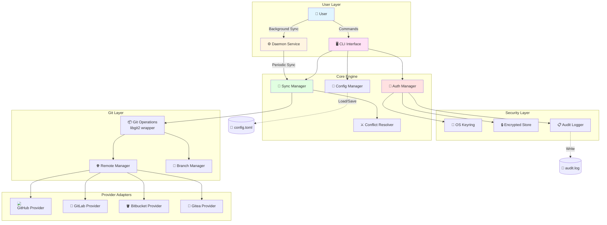
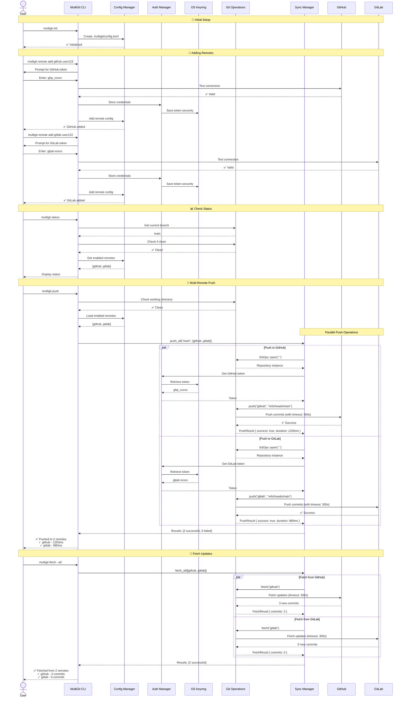
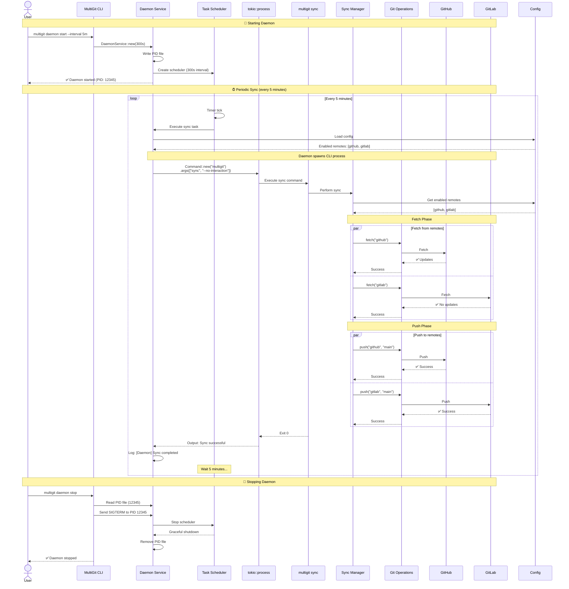
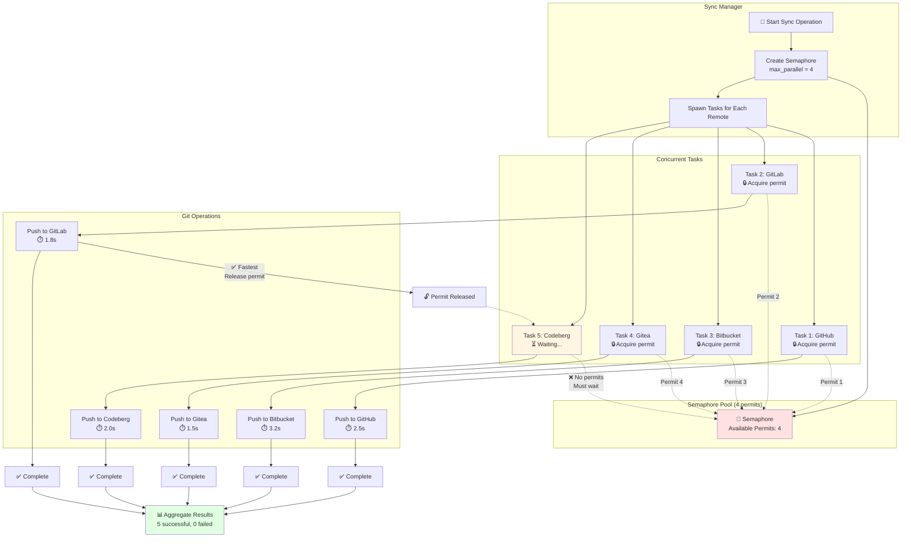
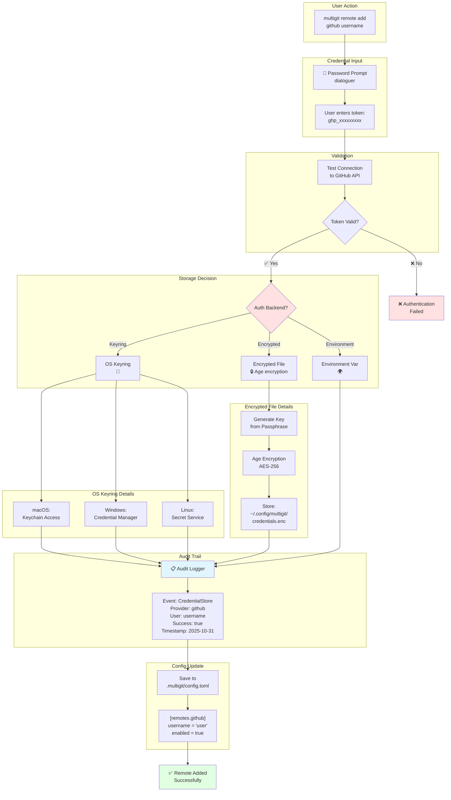
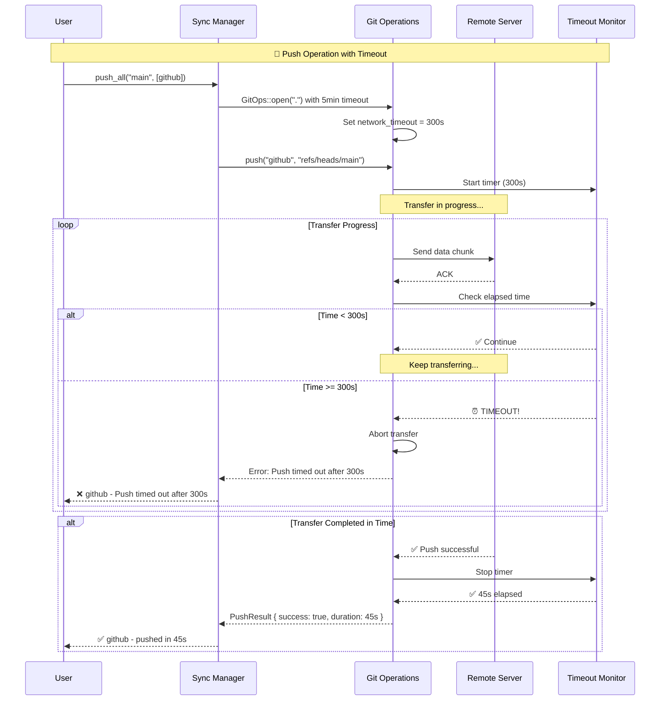
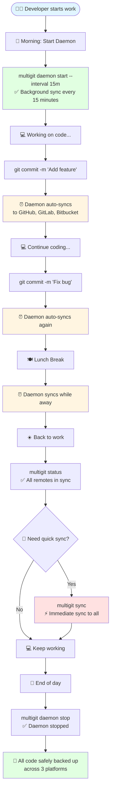
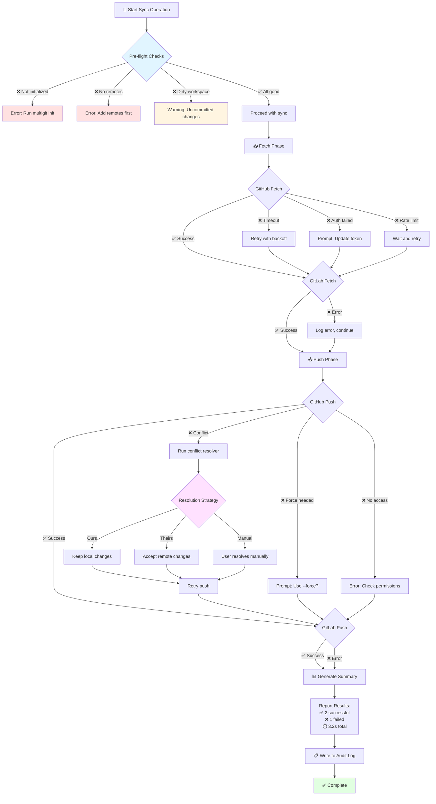

# MultiGit Architecture & Flow Diagrams

This document contains Mermaid.js diagrams illustrating how MultiGit works in real-life scenarios.

---

## 1. High-Level Architecture Overview

---

## 2. Complete User Workflow - From Setup to Sync

---

## 3. Daemon Background Sync Operation

---

## 4. Parallel Operations with Semaphore Control

---

## 5. Authentication & Security Flow

---

## 6. Network Timeout Protection

---

## 7. Real-World Usage Scenario

---

## 8. Error Handling & Recovery

---

## Legend

- 🚀 **Start/Launch** - Beginning of operation
- ✅ **Success** - Operation completed successfully
- ❌ **Error** - Operation failed
- ⏰ **Timer** - Time-based operation
- 🔐 **Security** - Authentication/encryption
- 📊 **Report** - Status/summary
- ⚡ **Fast** - Quick operation
- 🔄 **Sync** - Synchronization operation
- 📥 **Fetch** - Download operation
- 📤 **Push** - Upload operation
- 🔒 **Lock** - Resource acquired
- 🔓 **Unlock** - Resource released

---

**Generated**: 2025-10-31  
**Version**: MultiGit v1.0.0  
**Tool**: Mermaid.js
