# 🎨 MultiGit - Complete System Diagrams

> Comprehensive visual documentation of all MultiGit workflows, architecture, and processes

---

## 📋 Table of Contents

1. [System Architecture](#1-system-architecture)
2. [Push Flow](#2-push-flow)
3. [Sync Flow](#3-sync-flow)
4. [Conflict Resolution Flow](#4-conflict-resolution-flow)
5. [Authentication Flow](#5-authentication-flow)
6. [Daemon Operation Flow](#6-daemon-operation-flow)
7. [Provider Integration](#7-provider-integration)
8. [Repository Lifecycle](#8-repository-lifecycle)
9. [Error Handling Flow](#9-error-handling-flow)
10. [Data Flow](#10-data-flow)
11. [Component Interaction](#11-component-interaction)
12. [Deployment Architecture](#12-deployment-architecture)

---

## 1. System Architecture

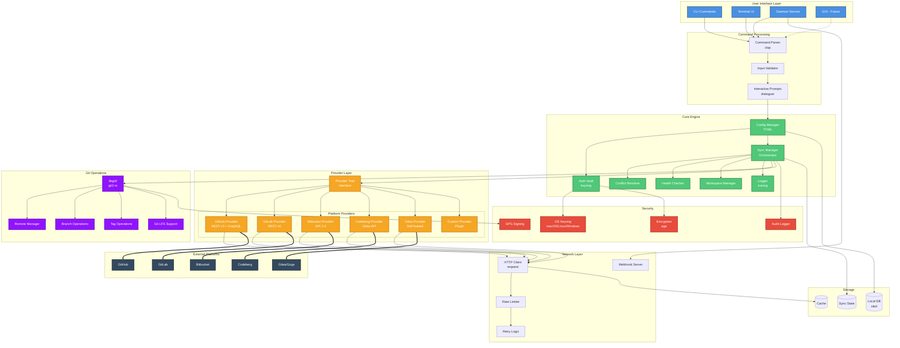
```mermaid
graph TB
    subgraph "User Interface Layer"
        CLI[CLI Commands]
        TUI[Terminal UI]
        DAEMON[Daemon Service]
        GUI[GUI - Future]
    end

    subgraph "Command Processing"
        PARSER[Command Parser<br/>clap]
        VALIDATOR[Input Validator]
        INTERACTIVE[Interactive Prompts<br/>dialoguer]
    end

    subgraph "Core Engine"
        CONFIG[Config Manager<br/>TOML]
        AUTH[Auth Vault<br/>keyring]
        SYNC[Sync Manager<br/>Orchestrator]
        CONFLICT[Conflict Resolver]
        HEALTH[Health Checker]
        WORKSPACE[Workspace Manager]
        LOGGER[Logger<br/>tracing]
    end

    subgraph "Provider Layer"
        TRAIT[Provider Trait<br/>Interface]
        
        subgraph "Platform Providers"
            GITHUB[GitHub Provider<br/>REST v3 + GraphQL]
            GITLAB[GitLab Provider<br/>REST v4]
            BITBUCKET[Bitbucket Provider<br/>API 2.0]
            CODEBERG[Codeberg Provider<br/>Gitea API]
            GITEA[Gitea Provider<br/>Self-hosted]
            CUSTOM[Custom Provider<br/>Plugin]
        end
    end

    subgraph "Git Operations"
        GIT2[libgit2<br/>git2-rs]
        REMOTE[Remote Manager]
        BRANCH[Branch Operations]
        TAG[Tag Operations]
        LFS[Git LFS Support]
    end

    subgraph "Network Layer"
        HTTP[HTTP Client<br/>reqwest]
        RATELIMIT[Rate Limiter]
        RETRY[Retry Logic]
        WEBHOOK[Webhook Server]
    end

    subgraph "Security"
        KEYRING[OS Keyring<br/>macOS/Linux/Windows]
        ENCRYPT[Encryption<br/>age]
        AUDIT[Audit Logger]
        GPG[GPG Signing]
    end

    subgraph "Storage"
        DB[(Local DB<br/>sled)]
        CACHE[(Cache)]
        STATE[(Sync State)]
    end

    subgraph "External Platforms"
        GH[GitHub]
        GL[GitLab]
        BB[Bitbucket]
        CB[Codeberg]
        GT[Gitea/Gogs]
    end

    CLI --> PARSER
    TUI --> PARSER
    DAEMON --> PARSER
    GUI -.-> PARSER
    PARSER --> VALIDATOR
    VALIDATOR --> INTERACTIVE
    INTERACTIVE --> CONFIG
    CONFIG --> AUTH
    CONFIG --> SYNC
    SYNC --> CONFLICT
    SYNC --> HEALTH
    SYNC --> WORKSPACE
    SYNC --> LOGGER
    SYNC --> TRAIT
    TRAIT --> GITHUB
    TRAIT --> GITLAB
    TRAIT --> BITBUCKET
    TRAIT --> CODEBERG
    TRAIT --> GITEA
    TRAIT --> CUSTOM
    SYNC --> GIT2
    GIT2 --> REMOTE
    GIT2 --> BRANCH
    GIT2 --> TAG
    GIT2 --> LFS
    GITHUB --> HTTP
    GITLAB --> HTTP
    BITBUCKET --> HTTP
    CODEBERG --> HTTP
    GITEA --> HTTP
    HTTP --> RATELIMIT
    RATELIMIT --> RETRY
    DAEMON --> WEBHOOK
    AUTH --> KEYRING
    AUTH --> ENCRYPT
    SYNC --> AUDIT
    GIT2 --> GPG
    CONFIG --> DB
    SYNC --> STATE
    HTTP --> CACHE
    GITHUB ==> GH
    GITLAB ==> GL
    BITBUCKET ==> BB
    CODEBERG ==> CB
    GITEA ==> GT

    classDef userLayer fill:#4A90E2,stroke:#2E5C8A,stroke-width:2px,color:#fff
    classDef coreLayer fill:#50C878,stroke:#2E7D4E,stroke-width:2px,color:#fff
    classDef providerLayer fill:#F5A623,stroke:#C27D1A,stroke-width:2px,color:#fff
    classDef gitLayer fill:#9013FE,stroke:#6A0FBF,stroke-width:2px,color:#fff
    classDef securityLayer fill:#E74C3C,stroke:#A93226,stroke-width:2px,color:#fff
    classDef externalLayer fill:#34495E,stroke:#1C2833,stroke-width:2px,color:#fff

    class CLI,TUI,DAEMON,GUI userLayer
    class CONFIG,AUTH,SYNC,CONFLICT,HEALTH,WORKSPACE,LOGGER coreLayer
    class TRAIT,GITHUB,GITLAB,BITBUCKET,CODEBERG,GITEA,CUSTOM providerLayer
    class GIT2,REMOTE,BRANCH,TAG,LFS gitLayer
    class KEYRING,ENCRYPT,AUDIT,GPG securityLayer
    class GH,GL,BB,CB,GT externalLayer
```

---

## 2. Push Flow

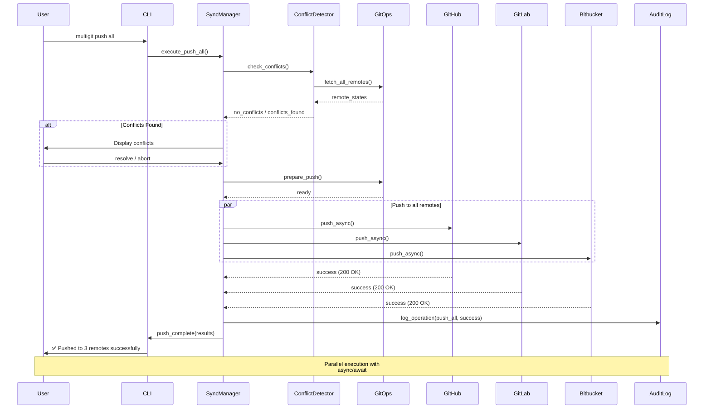
```mermaid
sequenceDiagram
    participant User
    participant CLI
    participant SyncManager
    participant ConflictDetector
    participant GitOps
    participant GitHub
    participant GitLab
    participant Bitbucket
    participant AuditLog

    User->>CLI: multigit push all
    CLI->>SyncManager: execute_push_all()
    
    SyncManager->>ConflictDetector: check_conflicts()
    ConflictDetector->>GitOps: fetch_all_remotes()
    GitOps-->>ConflictDetector: remote_states
    ConflictDetector-->>SyncManager: no_conflicts / conflicts_found
    
    alt Conflicts Found
        SyncManager->>User: Display conflicts
        User->>SyncManager: resolve / abort
    end
    
    SyncManager->>GitOps: prepare_push()
    GitOps-->>SyncManager: ready
    
    par Push to all remotes
        SyncManager->>GitHub: push_async()
        SyncManager->>GitLab: push_async()
        SyncManager->>Bitbucket: push_async()
    end
    
    GitHub-->>SyncManager: success (200 OK)
    GitLab-->>SyncManager: success (200 OK)
    Bitbucket-->>SyncManager: success (200 OK)
    
    SyncManager->>AuditLog: log_operation(push_all, success)
    SyncManager->>CLI: push_complete(results)
    CLI->>User: ✅ Pushed to 3 remotes successfully
    
    Note over User,AuditLog: Parallel execution with<br/>async/await
```

---

## 3. Sync Flow

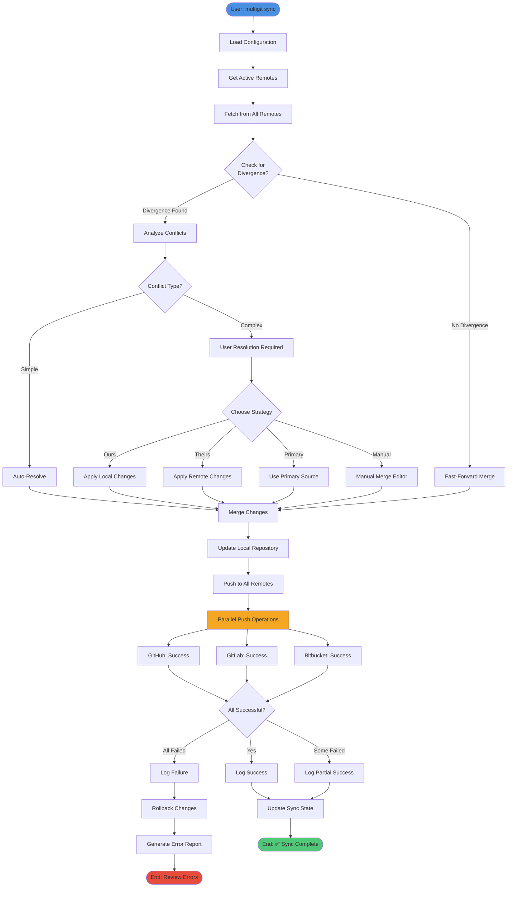
```mermaid
flowchart TD
    Start([User: multigit sync]) --> LoadConfig[Load Configuration]
    LoadConfig --> GetRemotes[Get Active Remotes]
    GetRemotes --> FetchAll[Fetch from All Remotes]
    
    FetchAll --> CheckDiverge{Check for<br/>Divergence?}
    
    CheckDiverge -->|No Divergence| FastForward[Fast-Forward Merge]
    CheckDiverge -->|Divergence Found| AnalyzeConflicts[Analyze Conflicts]
    
    AnalyzeConflicts --> ConflictType{Conflict Type?}
    
    ConflictType -->|Simple| AutoResolve[Auto-Resolve]
    ConflictType -->|Complex| UserResolve[User Resolution Required]
    
    UserResolve --> ResolutionChoice{Choose Strategy}
    ResolutionChoice -->|Ours| ApplyOurs[Apply Local Changes]
    ResolutionChoice -->|Theirs| ApplyTheirs[Apply Remote Changes]
    ResolutionChoice -->|Primary| ApplyPrimary[Use Primary Source]
    ResolutionChoice -->|Manual| ManualMerge[Manual Merge Editor]
    
    AutoResolve --> Merge[Merge Changes]
    ApplyOurs --> Merge
    ApplyTheirs --> Merge
    ApplyPrimary --> Merge
    ManualMerge --> Merge
    FastForward --> Merge
    
    Merge --> UpdateLocal[Update Local Repository]
    UpdateLocal --> PushAll[Push to All Remotes]
    
    PushAll --> Parallel[Parallel Push Operations]
    
    Parallel --> Result1[GitHub: Success]
    Parallel --> Result2[GitLab: Success]
    Parallel --> Result3[Bitbucket: Success]
    
    Result1 --> Verify{All Successful?}
    Result2 --> Verify
    Result3 --> Verify
    
    Verify -->|Yes| LogSuccess[Log Success]
    Verify -->|Some Failed| LogPartial[Log Partial Success]
    Verify -->|All Failed| LogFailure[Log Failure]
    
    LogSuccess --> UpdateState[Update Sync State]
    LogPartial --> UpdateState
    LogFailure --> Rollback[Rollback Changes]
    
    Rollback --> ErrorReport[Generate Error Report]
    ErrorReport --> End([End: Review Errors])
    
    UpdateState --> Success([End: ✅ Sync Complete])
    
    style Start fill:#4A90E2
    style Success fill:#50C878
    style End fill:#E74C3C
    style Parallel fill:#F5A623
```

---

## 4. Conflict Resolution Flow

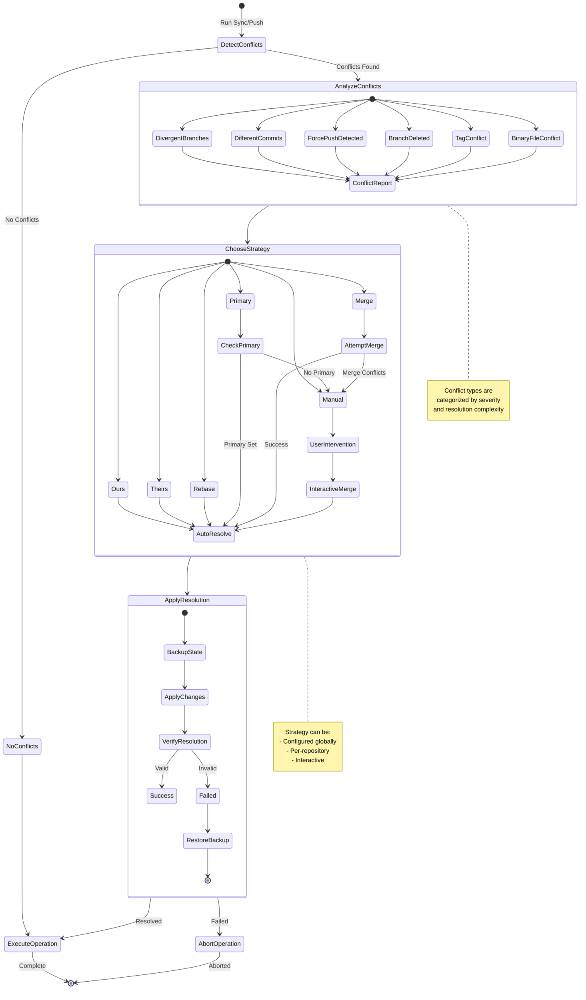
```mermaid
stateDiagram-v2
    [*] --> DetectConflicts: Run Sync/Push
    
    DetectConflicts --> AnalyzeConflicts: Conflicts Found
    DetectConflicts --> NoConflicts: No Conflicts
    
    NoConflicts --> ExecuteOperation
    
    state AnalyzeConflicts {
        [*] --> DivergentBranches
        [*] --> DifferentCommits
        [*] --> ForcePushDetected
        [*] --> BranchDeleted
        [*] --> TagConflict
        [*] --> BinaryFileConflict
        
        DivergentBranches --> ConflictReport
        DifferentCommits --> ConflictReport
        ForcePushDetected --> ConflictReport
        BranchDeleted --> ConflictReport
        TagConflict --> ConflictReport
        BinaryFileConflict --> ConflictReport
    }
    
    AnalyzeConflicts --> ChooseStrategy
    
    state ChooseStrategy {
        [*] --> Manual
        [*] --> Ours
        [*] --> Theirs
        [*] --> Primary
        [*] --> Rebase
        [*] --> Merge
        
        Manual --> UserIntervention
        Ours --> AutoResolve
        Theirs --> AutoResolve
        Primary --> CheckPrimary
        Rebase --> AutoResolve
        Merge --> AttemptMerge
        
        CheckPrimary --> AutoResolve: Primary Set
        CheckPrimary --> Manual: No Primary
        
        AttemptMerge --> AutoResolve: Success
        AttemptMerge --> Manual: Merge Conflicts
        
        UserIntervention --> InteractiveMerge
        InteractiveMerge --> AutoResolve
    }
    
    ChooseStrategy --> ApplyResolution
    
    state ApplyResolution {
        [*] --> BackupState
        BackupState --> ApplyChanges
        ApplyChanges --> VerifyResolution
        VerifyResolution --> Success: Valid
        VerifyResolution --> Failed: Invalid
        
        Failed --> RestoreBackup
        RestoreBackup --> [*]
    }
    
    ApplyResolution --> ExecuteOperation: Resolved
    ApplyResolution --> AbortOperation: Failed
    
    ExecuteOperation --> [*]: Complete
    AbortOperation --> [*]: Aborted
    
    note right of AnalyzeConflicts
        Conflict types are
        categorized by severity
        and resolution complexity
    end note
    
    note right of ChooseStrategy
        Strategy can be:
        - Configured globally
        - Per-repository
        - Interactive
    end note
```

---

## 5. Authentication Flow

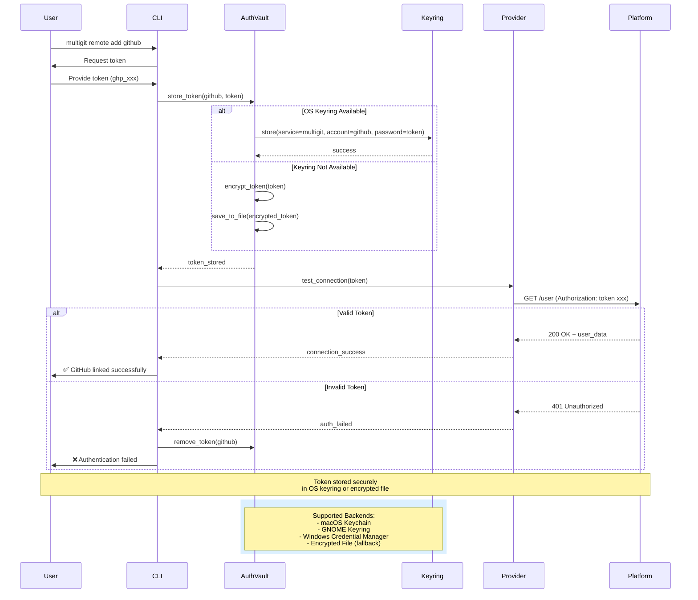
```mermaid
sequenceDiagram
    participant User
    participant CLI
    participant AuthVault
    participant Keyring
    participant Provider
    participant Platform

    User->>CLI: multigit remote add github
    CLI->>User: Request token
    User->>CLI: Provide token (ghp_xxx)
    
    CLI->>AuthVault: store_token(github, token)
    
    alt OS Keyring Available
        AuthVault->>Keyring: store(service=multigit, account=github, password=token)
        Keyring-->>AuthVault: success
    else Keyring Not Available
        AuthVault->>AuthVault: encrypt_token(token)
        AuthVault->>AuthVault: save_to_file(encrypted_token)
    end
    
    AuthVault-->>CLI: token_stored
    
    CLI->>Provider: test_connection(token)
    Provider->>Platform: GET /user (Authorization: token xxx)
    
    alt Valid Token
        Platform-->>Provider: 200 OK + user_data
        Provider-->>CLI: connection_success
        CLI->>User: ✅ GitHub linked successfully
    else Invalid Token
        Platform-->>Provider: 401 Unauthorized
        Provider-->>CLI: auth_failed
        CLI->>AuthVault: remove_token(github)
        CLI->>User: ❌ Authentication failed
    end
    
    Note over User,Platform: Token stored securely<br/>in OS keyring or encrypted file
    
    rect rgb(220, 240, 255)
        Note over AuthVault,Keyring: Supported Backends:<br/>- macOS Keychain<br/>- GNOME Keyring<br/>- Windows Credential Manager<br/>- Encrypted File (fallback)
    end
```

---

## 6. Daemon Operation Flow

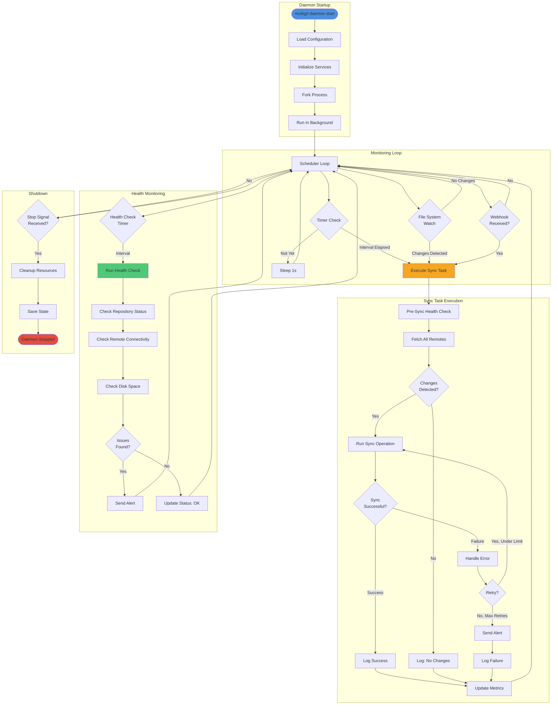
```mermaid
flowchart TB
    subgraph "Daemon Startup"
        Start([multigit daemon start]) --> LoadConfig[Load Configuration]
        LoadConfig --> InitServices[Initialize Services]
        InitServices --> Fork[Fork Process]
        Fork --> Background[Run in Background]
    end
    
    subgraph "Monitoring Loop"
        Background --> Scheduler[Scheduler Loop]
        
        Scheduler --> TimerCheck{Timer Check}
        TimerCheck -->|Interval Elapsed| SyncTask[Execute Sync Task]
        TimerCheck -->|Not Yet| Sleep[Sleep 1s]
        Sleep --> Scheduler
        
        Scheduler --> FSWatch{File System<br/>Watch}
        FSWatch -->|Changes Detected| SyncTask
        FSWatch -->|No Changes| Scheduler
        
        Scheduler --> WebhookCheck{Webhook<br/>Received?}
        WebhookCheck -->|Yes| SyncTask
        WebhookCheck -->|No| Scheduler
    end
    
    subgraph "Sync Task Execution"
        SyncTask --> PreCheck[Pre-Sync Health Check]
        PreCheck --> FetchRemotes[Fetch All Remotes]
        FetchRemotes --> DetectChanges{Changes<br/>Detected?}
        
        DetectChanges -->|Yes| RunSync[Run Sync Operation]
        DetectChanges -->|No| LogNoChanges[Log: No Changes]
        
        RunSync --> CheckResult{Sync<br/>Successful?}
        CheckResult -->|Success| LogSuccess[Log Success]
        CheckResult -->|Failure| HandleError[Handle Error]
        
        HandleError --> RetryCheck{Retry?}
        RetryCheck -->|Yes, Under Limit| RunSync
        RetryCheck -->|No, Max Retries| SendAlert[Send Alert]
        
        SendAlert --> LogFailure[Log Failure]
        LogSuccess --> UpdateMetrics[Update Metrics]
        LogNoChanges --> UpdateMetrics
        LogFailure --> UpdateMetrics
    end
    
    UpdateMetrics --> Scheduler
    
    subgraph "Health Monitoring"
        Scheduler --> HealthTimer{Health Check<br/>Timer}
        HealthTimer -->|Interval| RunHealth[Run Health Check]
        RunHealth --> CheckRepos[Check Repository Status]
        CheckRepos --> CheckRemotes[Check Remote Connectivity]
        CheckRemotes --> CheckDisk[Check Disk Space]
        CheckDisk --> HealthReport{Issues<br/>Found?}
        
        HealthReport -->|Yes| AlertUser[Send Alert]
        HealthReport -->|No| HealthOK[Update Status: OK]
        
        AlertUser --> Scheduler
        HealthOK --> Scheduler
    end
    
    subgraph "Shutdown"
        Scheduler --> StopSignal{Stop Signal<br/>Received?}
        StopSignal -->|No| Scheduler
        StopSignal -->|Yes| Cleanup[Cleanup Resources]
        Cleanup --> SaveState[Save State]
        SaveState --> Exit([Daemon Stopped])
    end
    
    style Start fill:#4A90E2
    style SyncTask fill:#F5A623
    style RunHealth fill:#50C878
    style Exit fill:#E74C3C
```

---

## 7. Provider Integration

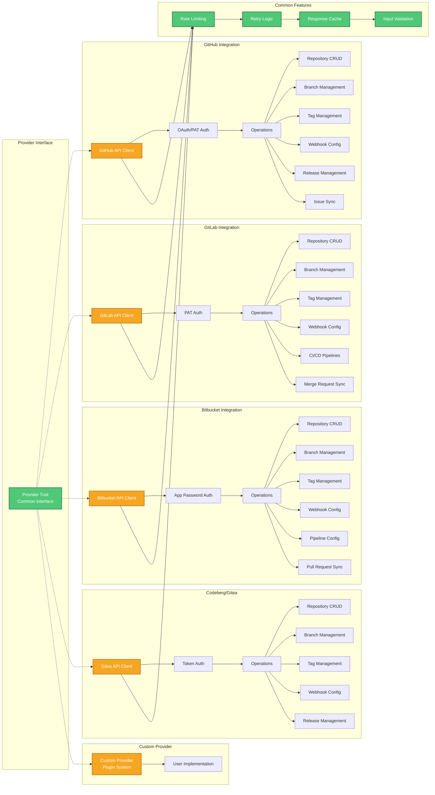
```mermaid
graph LR
    subgraph "Provider Interface"
        Trait[Provider Trait<br/>Common Interface]
    end
    
    subgraph "GitHub Integration"
        GH_API[GitHub API Client]
        GH_Auth[OAuth/PAT Auth]
        GH_Ops[Operations]
        
        GH_Ops --> GH_Repo[Repository CRUD]
        GH_Ops --> GH_Branch[Branch Management]
        GH_Ops --> GH_Tag[Tag Management]
        GH_Ops --> GH_Webhook[Webhook Config]
        GH_Ops --> GH_Release[Release Management]
        GH_Ops --> GH_Issues[Issue Sync]
    end
    
    subgraph "GitLab Integration"
        GL_API[GitLab API Client]
        GL_Auth[PAT Auth]
        GL_Ops[Operations]
        
        GL_Ops --> GL_Repo[Repository CRUD]
        GL_Ops --> GL_Branch[Branch Management]
        GL_Ops --> GL_Tag[Tag Management]
        GL_Ops --> GL_Webhook[Webhook Config]
        GL_Ops --> GL_CI[CI/CD Pipelines]
        GL_Ops --> GL_MR[Merge Request Sync]
    end
    
    subgraph "Bitbucket Integration"
        BB_API[Bitbucket API Client]
        BB_Auth[App Password Auth]
        BB_Ops[Operations]
        
        BB_Ops --> BB_Repo[Repository CRUD]
        BB_Ops --> BB_Branch[Branch Management]
        BB_Ops --> BB_Tag[Tag Management]
        BB_Ops --> BB_Webhook[Webhook Config]
        BB_Ops --> BB_Pipeline[Pipeline Config]
        BB_Ops --> BB_PR[Pull Request Sync]
    end
    
    subgraph "Codeberg/Gitea"
        GT_API[Gitea API Client]
        GT_Auth[Token Auth]
        GT_Ops[Operations]
        
        GT_Ops --> GT_Repo[Repository CRUD]
        GT_Ops --> GT_Branch[Branch Management]
        GT_Ops --> GT_Tag[Tag Management]
        GT_Ops --> GT_Webhook[Webhook Config]
        GT_Ops --> GT_Release[Release Management]
    end
    
    subgraph "Custom Provider"
        Custom[Custom Provider<br/>Plugin System]
        Custom --> CustomImpl[User Implementation]
    end
    
    Trait -.-> GH_API
    Trait -.-> GL_API
    Trait -.-> BB_API
    Trait -.-> GT_API
    Trait -.-> Custom
    
    GH_API --> GH_Auth
    GL_API --> GL_Auth
    BB_API --> BB_Auth
    GT_API --> GT_Auth
    
    GH_Auth --> GH_Ops
    GL_Auth --> GL_Ops
    BB_Auth --> BB_Ops
    GT_Auth --> GT_Ops
    
    subgraph "Common Features"
        RateLimit[Rate Limiting]
        Retry[Retry Logic]
        Cache[Response Cache]
        Validate[Input Validation]
    end
    
    GH_API --> RateLimit
    GL_API --> RateLimit
    BB_API --> RateLimit
    GT_API --> RateLimit
    
    RateLimit --> Retry
    Retry --> Cache
    Cache --> Validate
    
    classDef provider fill:#F5A623,stroke:#C27D1A,stroke-width:2px,color:#fff
    classDef common fill:#50C878,stroke:#2E7D4E,stroke-width:2px,color:#fff
    
    class GH_API,GL_API,BB_API,GT_API,Custom provider
    class Trait,RateLimit,Retry,Cache,Validate common
```

---

## 8. Repository Lifecycle

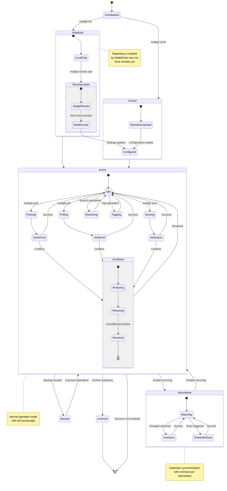
```mermaid
stateDiagram-v2
    [*] --> Uninitialized
    
    Uninitialized --> Initialized: multigit init
    Uninitialized --> Cloned: multigit clone
    
    state Initialized {
        [*] --> LocalOnly
        LocalOnly --> RemoteLinked: multigit remote add
        
        state RemoteLinked {
            [*] --> SingleRemote
            SingleRemote --> MultiRemote: Add more remotes
            MultiRemote --> Configured: Settings applied
        }
    }
    
    state Cloned {
        [*] --> RemotesImported
        RemotesImported --> Configured: Configuration loaded
    }
    
    Initialized --> Active
    Cloned --> Active
    
    state Active {
        [*] --> Idle
        Idle --> Pushing: multigit push
        Idle --> Pulling: multigit pull
        Idle --> Syncing: multigit sync
        Idle --> Branching: Branch operations
        Idle --> Tagging: Tag operations
        
        Pushing --> VerifyPush
        VerifyPush --> Idle: Success
        VerifyPush --> Conflicted: Conflicts
        
        Pulling --> VerifyPull
        VerifyPull --> Idle: Success
        VerifyPull --> Conflicted: Conflicts
        
        Syncing --> VerifySync
        VerifySync --> Idle: Success
        VerifySync --> Conflicted: Conflicts
        
        Branching --> Idle
        Tagging --> Idle
        
        state Conflicted {
            [*] --> Analyzing
            Analyzing --> Resolving
            Resolving --> Resolved: Auto/Manual resolve
            Resolved --> [*]
        }
        
        Conflicted --> Idle: Resolved
    }
    
    Active --> MirrorMode: Enable mirroring
    
    state MirrorMode {
        [*] --> Watching
        Watching --> AutoSync: Changes detected
        AutoSync --> Watching: Synced
        
        Watching --> ScheduledSync: Timer triggered
        ScheduledSync --> Watching: Synced
    }
    
    MirrorMode --> Active: Disable mirroring
    
    Active --> Backed: Backup created
    Backed --> Active: Continue operations
    
    Active --> Archived: Archive repository
    Archived --> [*]
    
    Active --> [*]: Remove from MultiGit
    
    note right of Initialized
        Repository is tracked
        by MultiGit but may not
        have remotes yet
    end note
    
    note right of Active
        Normal operation mode
        with full functionality
    end note
    
    note right of MirrorMode
        Automatic synchronization
        with minimal user intervention
    end note
```

---

## 9. Error Handling Flow

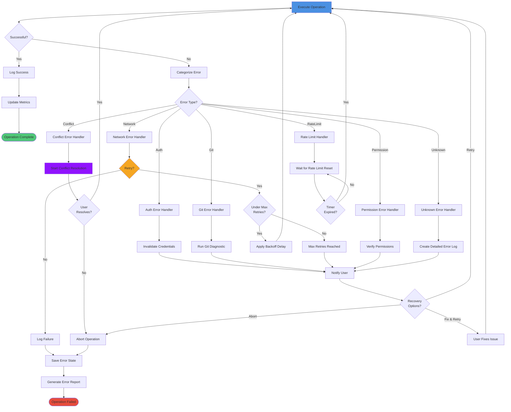
```mermaid
flowchart TD
    Operation[Execute Operation] --> Success{Successful?}
    
    Success -->|Yes| LogSuccess[Log Success]
    Success -->|No| CategorizeError[Categorize Error]
    
    LogSuccess --> UpdateMetrics[Update Metrics]
    UpdateMetrics --> Complete([Operation Complete])
    
    CategorizeError --> ErrorType{Error Type?}
    
    ErrorType -->|Network| NetworkError[Network Error Handler]
    ErrorType -->|Auth| AuthError[Auth Error Handler]
    ErrorType -->|Git| GitError[Git Error Handler]
    ErrorType -->|Conflict| ConflictError[Conflict Error Handler]
    ErrorType -->|RateLimit| RateLimitError[Rate Limit Handler]
    ErrorType -->|Permission| PermissionError[Permission Error Handler]
    ErrorType -->|Unknown| UnknownError[Unknown Error Handler]
    
    NetworkError --> RetryDecision{Retry?}
    AuthError --> InvalidateAuth[Invalidate Credentials]
    GitError --> GitDiagnostic[Run Git Diagnostic]
    ConflictError --> ConflictResolution[Start Conflict Resolution]
    RateLimitError --> WaitForReset[Wait for Rate Limit Reset]
    PermissionError --> CheckPermissions[Verify Permissions]
    UnknownError --> DetailedLog[Create Detailed Error Log]
    
    RetryDecision -->|Yes| CheckRetryCount{Under Max<br/>Retries?}
    RetryDecision -->|No| LogFailure[Log Failure]
    
    CheckRetryCount -->|Yes| BackoffDelay[Apply Backoff Delay]
    CheckRetryCount -->|No| MaxRetriesReached[Max Retries Reached]
    
    BackoffDelay --> Operation
    
    InvalidateAuth --> NotifyUser[Notify User]
    GitDiagnostic --> NotifyUser
    MaxRetriesReached --> NotifyUser
    CheckPermissions --> NotifyUser
    DetailedLog --> NotifyUser
    
    ConflictResolution --> UserResolve{User<br/>Resolves?}
    UserResolve -->|Yes| Operation
    UserResolve -->|No| Abort[Abort Operation]
    
    WaitForReset --> RateLimitTimer{Timer<br/>Expired?}
    RateLimitTimer -->|Yes| Operation
    RateLimitTimer -->|No| WaitForReset
    
    NotifyUser --> RecoveryOptions{Recovery<br/>Options?}
    
    RecoveryOptions -->|Retry| Operation
    RecoveryOptions -->|Fix & Retry| UserFix[User Fixes Issue]
    RecoveryOptions -->|Abort| Abort
    
    UserFix --> Operation
    
    LogFailure --> SaveState[Save Error State]
    Abort --> SaveState
    
    SaveState --> ErrorReport[Generate Error Report]
    ErrorReport --> Failed([Operation Failed])
    
    style Operation fill:#4A90E2
    style Complete fill:#50C878
    style Failed fill:#E74C3C
    style RetryDecision fill:#F5A623
    style ConflictResolution fill:#9013FE
```

---

## 10. Data Flow

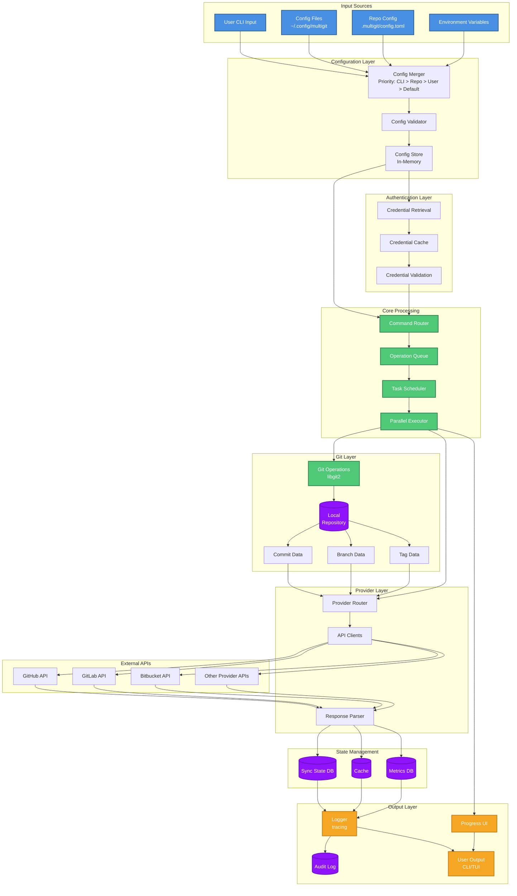
```mermaid
graph TB
    subgraph "Input Sources"
        UserCLI[User CLI Input]
        ConfigFile[Config Files<br/>~/.config/multigit]
        RepoConfig[Repo Config<br/>.multigit/config.toml]
        EnvVars[Environment Variables]
    end
    
    subgraph "Configuration Layer"
        ConfigMerger[Config Merger<br/>Priority: CLI > Repo > User > Default]
        ConfigValidator[Config Validator]
        ConfigStore[Config Store<br/>In-Memory]
    end
    
    subgraph "Authentication Layer"
        CredRetrieval[Credential Retrieval]
        CredCache[Credential Cache]
        CredValidation[Credential Validation]
    end
    
    subgraph "Core Processing"
        CommandRouter[Command Router]
        OperationQueue[Operation Queue]
        TaskScheduler[Task Scheduler]
        ParallelExecutor[Parallel Executor]
    end
    
    subgraph "Git Layer"
        LocalRepo[(Local<br/>Repository)]
        GitOps[Git Operations<br/>libgit2]
        CommitData[Commit Data]
        BranchData[Branch Data]
        TagData[Tag Data]
    end
    
    subgraph "Provider Layer"
        ProviderRouter[Provider Router]
        APIClients[API Clients]
        ResponseParser[Response Parser]
    end
    
    subgraph "External APIs"
        GitHubAPI[GitHub API]
        GitLabAPI[GitLab API]
        BitbucketAPI[Bitbucket API]
        OtherAPIs[Other Provider APIs]
    end
    
    subgraph "State Management"
        SyncState[(Sync State DB)]
        CacheStore[(Cache)]
        MetricsDB[(Metrics DB)]
    end
    
    subgraph "Output Layer"
        Logger[Logger<br/>tracing]
        ProgressUI[Progress UI]
        AuditLog[(Audit Log)]
        UserOutput[User Output<br/>CLI/TUI]
    end
    
    UserCLI --> ConfigMerger
    ConfigFile --> ConfigMerger
    RepoConfig --> ConfigMerger
    EnvVars --> ConfigMerger
    
    ConfigMerger --> ConfigValidator
    ConfigValidator --> ConfigStore
    
    ConfigStore --> CredRetrieval
    CredRetrieval --> CredCache
    CredCache --> CredValidation
    
    ConfigStore --> CommandRouter
    CredValidation --> CommandRouter
    
    CommandRouter --> OperationQueue
    OperationQueue --> TaskScheduler
    TaskScheduler --> ParallelExecutor
    
    ParallelExecutor --> GitOps
    GitOps --> LocalRepo
    LocalRepo --> CommitData
    LocalRepo --> BranchData
    LocalRepo --> TagData
    
    CommitData --> ProviderRouter
    BranchData --> ProviderRouter
    TagData --> ProviderRouter
    
    ParallelExecutor --> ProviderRouter
    ProviderRouter --> APIClients
    
    APIClients --> GitHubAPI
    APIClients --> GitLabAPI
    APIClients --> BitbucketAPI
    APIClients --> OtherAPIs
    
    GitHubAPI --> ResponseParser
    GitLabAPI --> ResponseParser
    BitbucketAPI --> ResponseParser
    OtherAPIs --> ResponseParser
    
    ResponseParser --> SyncState
    ResponseParser --> CacheStore
    ResponseParser --> MetricsDB
    
    SyncState --> Logger
    CacheStore --> Logger
    MetricsDB --> Logger
    
    Logger --> AuditLog
    Logger --> UserOutput
    
    ParallelExecutor --> ProgressUI
    ProgressUI --> UserOutput
    
    classDef input fill:#4A90E2,stroke:#2E5C8A,stroke-width:2px,color:#fff
    classDef process fill:#50C878,stroke:#2E7D4E,stroke-width:2px,color:#fff
    classDef storage fill:#9013FE,stroke:#6A0FBF,stroke-width:2px,color:#fff
    classDef output fill:#F5A623,stroke:#C27D1A,stroke-width:2px,color:#fff
    
    class UserCLI,ConfigFile,RepoConfig,EnvVars input
    class CommandRouter,OperationQueue,TaskScheduler,ParallelExecutor,GitOps process
    class LocalRepo,SyncState,CacheStore,MetricsDB,AuditLog storage
    class Logger,ProgressUI,UserOutput output
```

---

## 11. Component Interaction

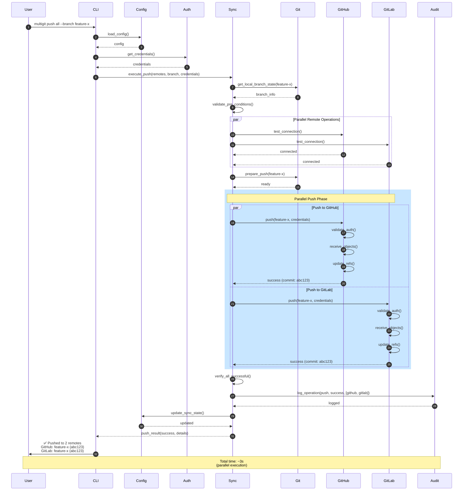
```mermaid
sequenceDiagram
    autonumber
    participant User
    participant CLI
    participant Config
    participant Auth
    participant Sync
    participant Git
    participant GitHub
    participant GitLab
    participant Audit

    User->>CLI: multigit push all --branch feature-x
    
    CLI->>Config: load_config()
    Config-->>CLI: config
    
    CLI->>Auth: get_credentials()
    Auth-->>CLI: credentials
    
    CLI->>Sync: execute_push(remotes, branch, credentials)
    
    Sync->>Git: get_local_branch_state(feature-x)
    Git-->>Sync: branch_info
    
    Sync->>Sync: validate_pre_conditions()
    
    par Parallel Remote Operations
        Sync->>GitHub: test_connection()
        Sync->>GitLab: test_connection()
        GitHub-->>Sync: connected
        GitLab-->>Sync: connected
    end
    
    Sync->>Git: prepare_push(feature-x)
    Git-->>Sync: ready
    
    rect rgb(200, 230, 255)
        Note over Sync,GitLab: Parallel Push Phase
        par Push to GitHub
            Sync->>GitHub: push(feature-x, credentials)
            GitHub->>GitHub: validate_auth()
            GitHub->>GitHub: receive_objects()
            GitHub->>GitHub: update_refs()
            GitHub-->>Sync: success (commit: abc123)
        and Push to GitLab
            Sync->>GitLab: push(feature-x, credentials)
            GitLab->>GitLab: validate_auth()
            GitLab->>GitLab: receive_objects()
            GitLab->>GitLab: update_refs()
            GitLab-->>Sync: success (commit: abc123)
        end
    end
    
    Sync->>Sync: verify_all_successful()
    
    Sync->>Audit: log_operation(push, success, [github, gitlab])
    Audit-->>Sync: logged
    
    Sync->>Config: update_sync_state()
    Config-->>Sync: updated
    
    Sync-->>CLI: push_result(success, details)
    
    CLI->>User: ✅ Pushed to 2 remotes<br/>GitHub: feature-x (abc123)<br/>GitLab: feature-x (abc123)
    
    Note over User,Audit: Total time: ~3s<br/>(parallel execution)
```

---

## 12. Deployment Architecture

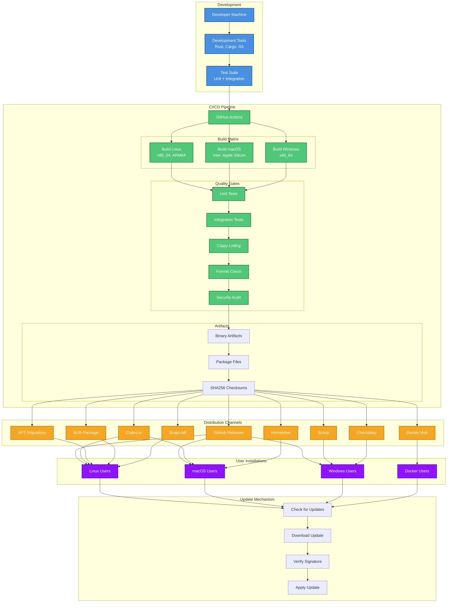
```mermaid
graph TB
    subgraph "Development"
        Dev[Developer Machine]
        DevTools[Development Tools<br/>Rust, Cargo, Git]
        Tests[Test Suite<br/>Unit + Integration]
    end
    
    subgraph "CI/CD Pipeline"
        GHActions[GitHub Actions]
        
        subgraph "Build Matrix"
            BuildLinux[Build Linux<br/>x86_64, ARM64]
            BuildMac[Build macOS<br/>Intel, Apple Silicon]
            BuildWin[Build Windows<br/>x86_64]
        end
        
        subgraph "Quality Gates"
            UnitTests[Unit Tests]
            IntTests[Integration Tests]
            Lint[Clippy Linting]
            Format[Format Check]
            Security[Security Audit]
        end
        
        subgraph "Artifacts"
            Binaries[Binary Artifacts]
            Packages[Package Files]
            Checksums[SHA256 Checksums]
        end
    end
    
    subgraph "Distribution Channels"
        GitHub[GitHub Releases]
        Crates[Crates.io]
        Brew[Homebrew]
        Scoop[Scoop]
        APT[APT Repository]
        AUR[AUR Package]
        Snap[Snapcraft]
        Choco[Chocolatey]
        Docker[Docker Hub]
    end
    
    subgraph "User Installations"
        LinuxUser[Linux Users]
        MacUser[macOS Users]
        WinUser[Windows Users]
        DockerUser[Docker Users]
    end
    
    subgraph "Update Mechanism"
        CheckUpdate[Check for Updates]
        DownloadUpdate[Download Update]
        ApplyUpdate[Apply Update]
        Verify[Verify Signature]
    end
    
    Dev --> DevTools
    DevTools --> Tests
    Tests --> GHActions
    
    GHActions --> BuildLinux
    GHActions --> BuildMac
    GHActions --> BuildWin
    
    BuildLinux --> UnitTests
    BuildMac --> UnitTests
    BuildWin --> UnitTests
    
    UnitTests --> IntTests
    IntTests --> Lint
    Lint --> Format
    Format --> Security
    
    Security --> Binaries
    Binaries --> Packages
    Packages --> Checksums
    
    Checksums --> GitHub
    Checksums --> Crates
    Checksums --> Brew
    Checksums --> Scoop
    Checksums --> APT
    Checksums --> AUR
    Checksums --> Snap
    Checksums --> Choco
    Checksums --> Docker
    
    GitHub --> LinuxUser
    GitHub --> MacUser
    GitHub --> WinUser
    
    Crates --> LinuxUser
    Crates --> MacUser
    
    Brew --> MacUser
    Scoop --> WinUser
    APT --> LinuxUser
    AUR --> LinuxUser
    Snap --> LinuxUser
    Choco --> WinUser
    Docker --> DockerUser
    
    LinuxUser --> CheckUpdate
    MacUser --> CheckUpdate
    WinUser --> CheckUpdate
    DockerUser --> CheckUpdate
    
    CheckUpdate --> DownloadUpdate
    DownloadUpdate --> Verify
    Verify --> ApplyUpdate
    
    classDef dev fill:#4A90E2,stroke:#2E5C8A,stroke-width:2px,color:#fff
    classDef ci fill:#50C878,stroke:#2E7D4E,stroke-width:2px,color:#fff
    classDef dist fill:#F5A623,stroke:#C27D1A,stroke-width:2px,color:#fff
    classDef user fill:#9013FE,stroke:#6A0FBF,stroke-width:2px,color:#fff
    
    class Dev,DevTools,Tests dev
    class GHActions,BuildLinux,BuildMac,BuildWin,UnitTests,IntTests,Lint,Format,Security ci
    class GitHub,Crates,Brew,Scoop,APT,AUR,Snap,Choco,Docker dist
    class LinuxUser,MacUser,WinUser,DockerUser user
```

---

## 13. Workspace Management Flow

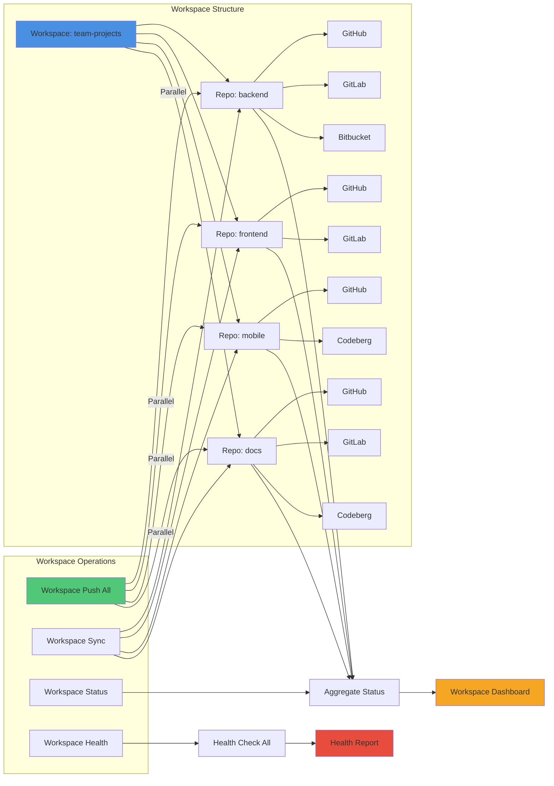
```mermaid
flowchart LR
    subgraph "Workspace Structure"
        WS[Workspace: team-projects]
        
        WS --> R1[Repo: backend]
        WS --> R2[Repo: frontend]
        WS --> R3[Repo: mobile]
        WS --> R4[Repo: docs]
        
        R1 --> R1G[GitHub]
        R1 --> R1L[GitLab]
        R1 --> R1B[Bitbucket]
        
        R2 --> R2G[GitHub]
        R2 --> R2L[GitLab]
        
        R3 --> R3G[GitHub]
        R3 --> R3C[Codeberg]
        
        R4 --> R4G[GitHub]
        R4 --> R4L[GitLab]
        R4 --> R4C[Codeberg]
    end
    
    subgraph "Workspace Operations"
        WSPush[Workspace Push All]
        WSSync[Workspace Sync]
        WSStatus[Workspace Status]
        WSHealth[Workspace Health]
    end
    
    WSPush --> |Parallel| R1
    WSPush --> |Parallel| R2
    WSPush --> |Parallel| R3
    WSPush --> |Parallel| R4
    
    WSSync --> R1
    WSSync --> R2
    WSSync --> R3
    WSSync --> R4
    
    WSStatus --> Aggregate[Aggregate Status]
    R1 --> Aggregate
    R2 --> Aggregate
    R3 --> Aggregate
    R4 --> Aggregate
    
    Aggregate --> Dashboard[Workspace Dashboard]
    
    WSHealth --> HealthCheck[Health Check All]
    HealthCheck --> Report[Health Report]
    
    style WS fill:#4A90E2
    style WSPush fill:#50C878
    style Dashboard fill:#F5A623
    style Report fill:#E74C3C
```

---

## 14. Plugin System Architecture

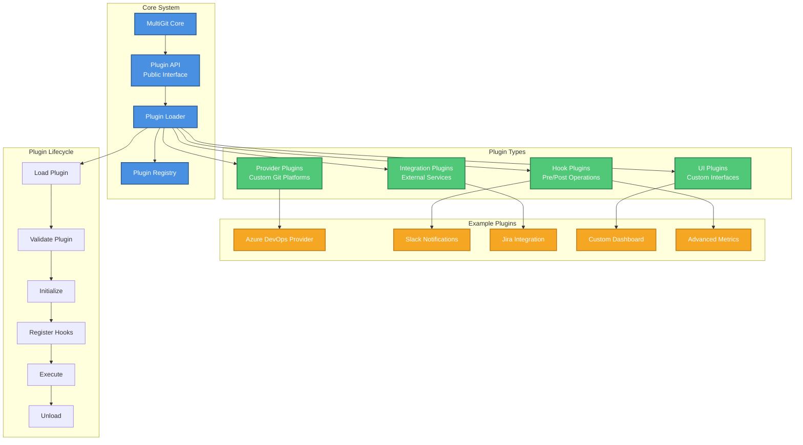
```mermaid
graph TB
    subgraph "Core System"
        Core[MultiGit Core]
        PluginAPI[Plugin API<br/>Public Interface]
        PluginLoader[Plugin Loader]
        PluginRegistry[Plugin Registry]
    end
    
    subgraph "Plugin Types"
        ProviderPlugin[Provider Plugins<br/>Custom Git Platforms]
        HookPlugin[Hook Plugins<br/>Pre/Post Operations]
        UIPlugin[UI Plugins<br/>Custom Interfaces]
        IntegrationPlugin[Integration Plugins<br/>External Services]
    end
    
    subgraph "Example Plugins"
        AzurePlugin[Azure DevOps Provider]
        SlackPlugin[Slack Notifications]
        JiraPlugin[Jira Integration]
        CustomUIPlugin[Custom Dashboard]
        MetricsPlugin[Advanced Metrics]
    end
    
    subgraph "Plugin Lifecycle"
        Load[Load Plugin]
        Validate[Validate Plugin]
        Initialize[Initialize]
        Register[Register Hooks]
        Execute[Execute]
        Unload[Unload]
    end
    
    Core --> PluginAPI
    PluginAPI --> PluginLoader
    PluginLoader --> PluginRegistry
    
    PluginLoader --> ProviderPlugin
    PluginLoader --> HookPlugin
    PluginLoader --> UIPlugin
    PluginLoader --> IntegrationPlugin
    
    ProviderPlugin --> AzurePlugin
    HookPlugin --> SlackPlugin
    IntegrationPlugin --> JiraPlugin
    UIPlugin --> CustomUIPlugin
    HookPlugin --> MetricsPlugin
    
    PluginLoader --> Load
    Load --> Validate
    Validate --> Initialize
    Initialize --> Register
    Register --> Execute
    Execute --> Unload
    
    classDef core fill:#4A90E2,stroke:#2E5C8A,stroke-width:2px,color:#fff
    classDef plugin fill:#50C878,stroke:#2E7D4E,stroke-width:2px,color:#fff
    classDef example fill:#F5A623,stroke:#C27D1A,stroke-width:2px,color:#fff
    
    class Core,PluginAPI,PluginLoader,PluginRegistry core
    class ProviderPlugin,HookPlugin,UIPlugin,IntegrationPlugin plugin
    class AzurePlugin,SlackPlugin,JiraPlugin,CustomUIPlugin,MetricsPlugin example
```

---

## 15. Security Architecture

```mermaid
graph TB
    subgraph "Security Layers"
        Input[User Input]
        
        subgraph "Input Validation"
            Sanitize[Input Sanitization]
            ValidateCmd[Command Validation]
            ValidateToken[Token Validation]
        end
        
        subgraph "Authentication"
            TokenStore[Token Storage]
            
            subgraph "Storage Backends"
                OSKeyring[OS Keyring<br/>Primary]
                EncryptedFile[Encrypted File<br/>Fallback]
                EnvVar[Environment Variables<br/>CI/CD Only]
            end
            
            TokenRetrieval[Token Retrieval]
            TokenValidation[Token Validation]
        end
        
        subgraph "Authorization"
            PermCheck[Permission Check]
            ScopeVerify[Scope Verification]
            RateLimit[Rate Limit Check]
        end
        
        subgraph "Communication Security"
            TLS[TLS/HTTPS Only]
            CertVerify[Certificate Verification]
            PinningOptional[Certificate Pinning<br/>Optional]
        end
        
        subgraph "Data Protection"
            MemProtect[Memory Protection]
            SecureWipe[Secure Wipe]
            NoPlaintext[No Plaintext Storage]
        end
        
        subgraph "Audit & Monitoring"
            AuditLog[Audit Logging]
            FailedAuth[Failed Auth Tracking]
            Alerts[Security Alerts]
        end
        
        subgraph "Git Security"
            GPGSign[GPG Commit Signing]
            SSHKey[SSH Key Management]
            VerifyCommits[Verify Commits]
        end
    end
    
    Input --> Sanitize
    Sanitize --> ValidateCmd
    ValidateCmd --> ValidateToken
    
    ValidateToken --> TokenStore
    TokenStore --> OSKeyring
    TokenStore --> EncryptedFile
    TokenStore --> EnvVar
    
    OSKeyring --> TokenRetrieval
    EncryptedFile --> TokenRetrieval
    EnvVar --> TokenRetrieval
    
    TokenRetrieval --> TokenValidation
    TokenValidation --> PermCheck
    
    PermCheck --> ScopeVerify
    ScopeVerify --> RateLimit
    
    RateLimit --> TLS
    TLS --> CertVerify
    CertVerify --> PinningOptional
    
    PinningOptional --> MemProtect
    MemProtect --> SecureWipe
    SecureWipe --> NoPlaintext
    
    TokenValidation --> AuditLog
    PermCheck --> AuditLog
    RateLimit --> FailedAuth
    FailedAuth --> Alerts
    
    TokenValidation --> GPGSign
    GPGSign --> SSHKey
    SSHKey --> VerifyCommits
    
    classDef security fill:#E74C3C,stroke:#A93226,stroke-width:2px,color:#fff
    classDef storage fill:#9013FE,stroke:#6A0FBF,stroke-width:2px,color:#fff
    classDef network fill:#50C878,stroke:#2E7D4E,stroke-width:2px,color:#fff
    
    class Sanitize,ValidateCmd,ValidateToken,PermCheck,ScopeVerify security
    class OSKeyring,EncryptedFile,EnvVar,TokenStore storage
    class TLS,CertVerify,PinningOptional network
```

---

## 16. Monitoring & Metrics Flow

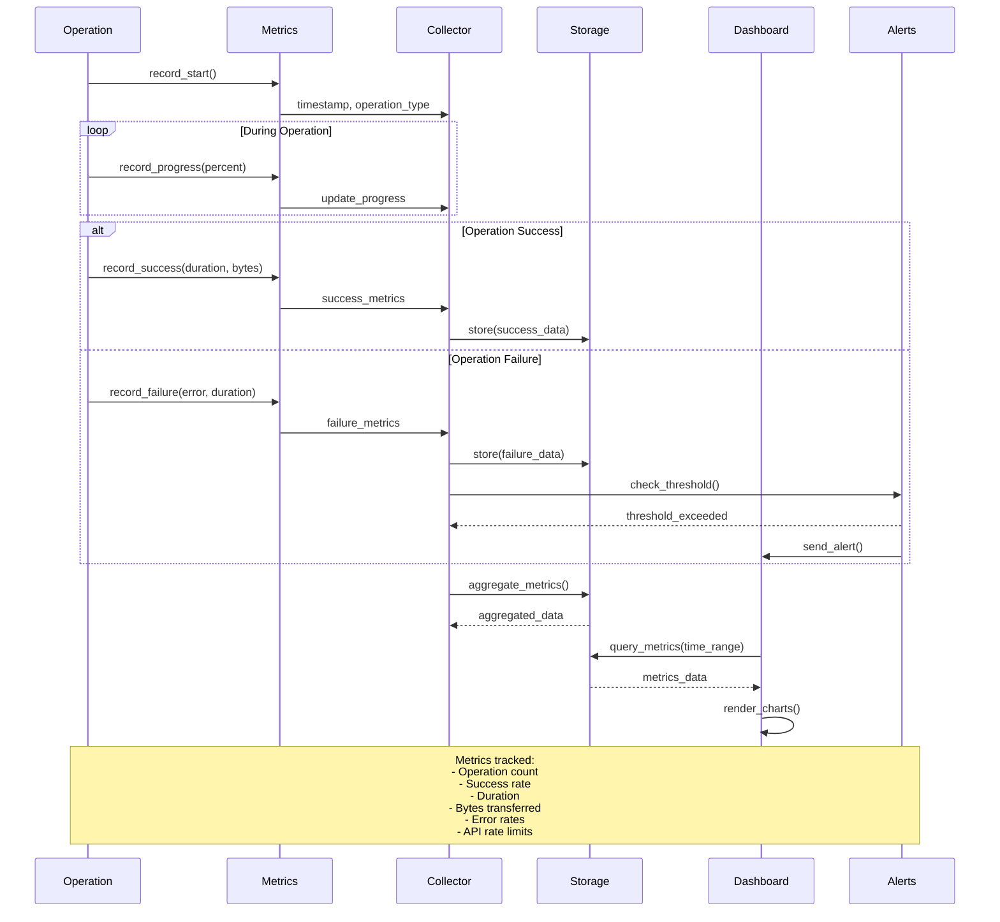
```mermaid
sequenceDiagram
    participant Operation
    participant Metrics
    participant Collector
    participant Storage
    participant Dashboard
    participant Alerts

    Operation->>Metrics: record_start()
    Metrics->>Collector: timestamp, operation_type
    
    loop During Operation
        Operation->>Metrics: record_progress(percent)
        Metrics->>Collector: update_progress
    end
    
    alt Operation Success
        Operation->>Metrics: record_success(duration, bytes)
        Metrics->>Collector: success_metrics
        Collector->>Storage: store(success_data)
    else Operation Failure
        Operation->>Metrics: record_failure(error, duration)
        Metrics->>Collector: failure_metrics
        Collector->>Storage: store(failure_data)
        Collector->>Alerts: check_threshold()
        Alerts-->>Collector: threshold_exceeded
        Alerts->>Dashboard: send_alert()
    end
    
    Collector->>Storage: aggregate_metrics()
    Storage-->>Collector: aggregated_data
    
    Dashboard->>Storage: query_metrics(time_range)
    Storage-->>Dashboard: metrics_data
    Dashboard->>Dashboard: render_charts()
    
    Note over Operation,Alerts: Metrics tracked:<br/>- Operation count<br/>- Success rate<br/>- Duration<br/>- Bytes transferred<br/>- Error rates<br/>- API rate limits
```

---

## 17. Conflict Resolution Decision Tree

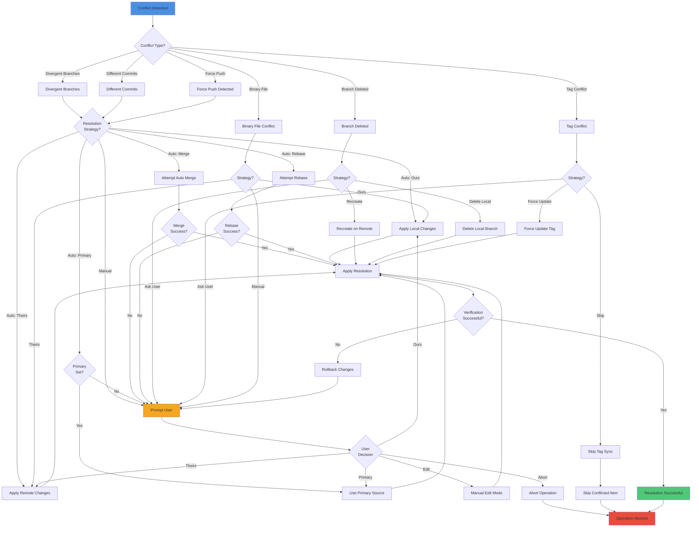
```mermaid
graph TD
    Start[Conflict Detected] --> Type{Conflict Type?}
    
    Type -->|Divergent Branches| DB[Divergent Branches]
    Type -->|Different Commits| DC[Different Commits]
    Type -->|Force Push| FP[Force Push Detected]
    Type -->|Branch Deleted| BD[Branch Deleted]
    Type -->|Tag Conflict| TC[Tag Conflict]
    Type -->|Binary File| BF[Binary File Conflict]
    
    DB --> Strategy{Resolution<br/>Strategy?}
    DC --> Strategy
    FP --> Strategy
    
    Strategy -->|Auto: Ours| ApplyOurs[Apply Local Changes]
    Strategy -->|Auto: Theirs| ApplyTheirs[Apply Remote Changes]
    Strategy -->|Auto: Primary| CheckPrimary{Primary<br/>Set?}
    Strategy -->|Auto: Merge| AttemptMerge[Attempt Auto Merge]
    Strategy -->|Auto: Rebase| AttemptRebase[Attempt Rebase]
    Strategy -->|Manual| UserPrompt[Prompt User]
    
    CheckPrimary -->|Yes| ApplyPrimary[Use Primary Source]
    CheckPrimary -->|No| UserPrompt
    
    AttemptMerge --> MergeResult{Merge<br/>Success?}
    MergeResult -->|Yes| Apply[Apply Resolution]
    MergeResult -->|No| UserPrompt
    
    AttemptRebase --> RebaseResult{Rebase<br/>Success?}
    RebaseResult -->|Yes| Apply
    RebaseResult -->|No| UserPrompt
    
    BD --> BDStrategy{Strategy?}
    BDStrategy -->|Recreate| RecreateRemote[Recreate on Remote]
    BDStrategy -->|Delete Local| DeleteLocal[Delete Local Branch]
    BDStrategy -->|Ask User| UserPrompt
    
    TC --> TCStrategy{Strategy?}
    TCStrategy -->|Force Update| ForceTag[Force Update Tag]
    TCStrategy -->|Skip| SkipTag[Skip Tag Sync]
    TCStrategy -->|Ask User| UserPrompt
    
    BF --> BFStrategy{Strategy?}
    BFStrategy -->|Ours| ApplyOurs
    BFStrategy -->|Theirs| ApplyTheirs
    BFStrategy -->|Manual| UserPrompt
    
    UserPrompt --> UserChoice{User<br/>Decision}
    UserChoice -->|Ours| ApplyOurs
    UserChoice -->|Theirs| ApplyTheirs
    UserChoice -->|Primary| ApplyPrimary
    UserChoice -->|Edit| ManualEdit[Manual Edit Mode]
    UserChoice -->|Abort| Abort[Abort Operation]
    
    ManualEdit --> Apply
    
    ApplyOurs --> Apply
    ApplyTheirs --> Apply
    ApplyPrimary --> Apply
    RecreateRemote --> Apply
    DeleteLocal --> Apply
    ForceTag --> Apply
    SkipTag --> Skip[Skip Conflicted Item]
    
    Apply --> Verify{Verification<br/>Successful?}
    Verify -->|Yes| Success[Resolution Successful]
    Verify -->|No| Rollback[Rollback Changes]
    
    Rollback --> UserPrompt
    Abort --> End[Operation Aborted]
    Skip --> End
    Success --> End
    
    style Start fill:#4A90E2
    style Success fill:#50C878
    style End fill:#E74C3C
    style UserPrompt fill:#F5A623
```

---

## 18. Rate Limiting Strategy

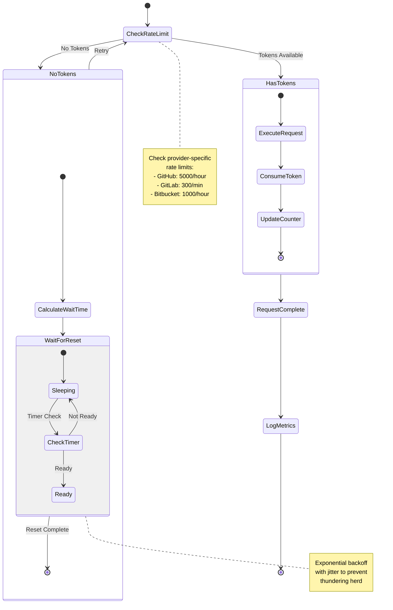
```mermaid
stateDiagram-v2
    [*] --> CheckRateLimit
    
    CheckRateLimit --> HasTokens: Tokens Available
    CheckRateLimit --> NoTokens: No Tokens
    
    state HasTokens {
        [*] --> ExecuteRequest
        ExecuteRequest --> ConsumeToken
        ConsumeToken --> UpdateCounter
        UpdateCounter --> [*]
    }
    
    HasTokens --> RequestComplete
    
    state NoTokens {
        [*] --> CalculateWaitTime
        CalculateWaitTime --> WaitForReset
        
        state WaitForReset {
            [*] --> Sleeping
            Sleeping --> CheckTimer: Timer Check
            CheckTimer --> Sleeping: Not Ready
            CheckTimer --> Ready: Ready
        }
        
        WaitForReset --> [*]: Reset Complete
    }
    
    NoTokens --> CheckRateLimit: Retry
    
    RequestComplete --> LogMetrics
    LogMetrics --> [*]
    
    note right of CheckRateLimit
        Check provider-specific
        rate limits:
        - GitHub: 5000/hour
        - GitLab: 300/min
        - Bitbucket: 1000/hour
    end note
    
    note right of WaitForReset
        Exponential backoff
        with jitter to prevent
        thundering herd
    end note
```

---

## 19. Complete User Journey

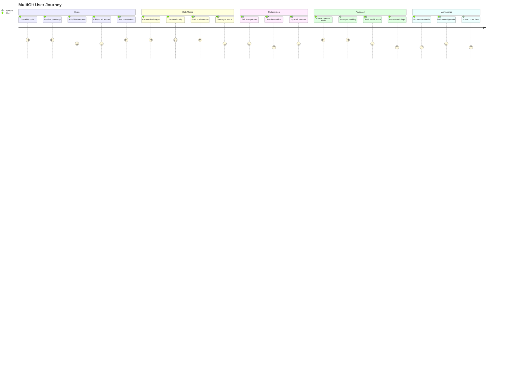
```mermaid
journey
    title MultiGit User Journey
    section Setup
      Install MultiGit: 5: User
      Initialize repository: 5: User
      Add GitHub remote: 4: User
      Add GitLab remote: 4: User
      Test connections: 5: User, System
    section Daily Usage
      Make code changes: 5: User
      Commit locally: 5: User
      Push to all remotes: 5: User, System
      View sync status: 4: User, System
    section Collaboration
      Pull from primary: 4: User, System
      Resolve conflicts: 3: User, System
      Sync all remotes: 4: User, System
    section Advanced
      Enable daemon mode: 5: User
      Auto-sync working: 5: System
      Check health status: 4: User, System
      Review audit logs: 3: User
    section Maintenance
      Update credentials: 3: User
      Backup configuration: 4: User, System
      Clean up old data: 3: System
```

---

## 20. Testing Strategy Pyramid

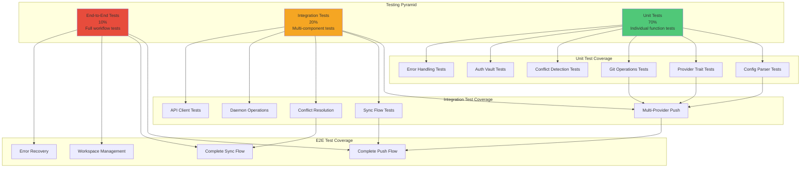
```mermaid
graph TB
    subgraph "Testing Pyramid"
        E2E[End-to-End Tests<br/>10%<br/>Full workflow tests]
        Integration[Integration Tests<br/>20%<br/>Multi-component tests]
        Unit[Unit Tests<br/>70%<br/>Individual function tests]
    end
    
    subgraph "Unit Test Coverage"
        U1[Config Parser Tests]
        U2[Provider Trait Tests]
        U3[Git Operations Tests]
        U4[Conflict Detection Tests]
        U5[Auth Vault Tests]
        U6[Error Handling Tests]
    end
    
    subgraph "Integration Test Coverage"
        I1[Multi-Provider Push]
        I2[Sync Flow Tests]
        I3[Conflict Resolution]
        I4[Daemon Operations]
        I5[API Client Tests]
    end
    
    subgraph "E2E Test Coverage"
        E1[Complete Push Flow]
        E2[Complete Sync Flow]
        E3[Workspace Management]
        E4[Error Recovery]
    end
    
    Unit --> U1
    Unit --> U2
    Unit --> U3
    Unit --> U4
    Unit --> U5
    Unit --> U6
    
    Integration --> I1
    Integration --> I2
    Integration --> I3
    Integration --> I4
    Integration --> I5
    
    E2E --> E1
    E2E --> E2
    E2E --> E3
    E2E --> E4
    
    U1 --> I1
    U2 --> I1
    U3 --> I1
    
    I1 --> E1
    I2 --> E1
    I3 --> E2
    
    style Unit fill:#50C878
    style Integration fill:#F5A623
    style E2E fill:#E74C3C
```

---

## Summary

This comprehensive diagram collection covers:

✅ **System Architecture** - Complete component overview
✅ **Workflow Diagrams** - Push, Sync, Conflict Resolution
✅ **Authentication** - Secure credential management
✅ **Daemon Operations** - Background automation
✅ **Provider Integration** - Multi-platform support
✅ **Error Handling** - Robust error recovery
✅ **Data Flow** - Information flow through system
✅ **Deployment** - CI/CD and distribution
✅ **Security** - Multi-layer security approach
✅ **Monitoring** - Metrics and observability
✅ **Testing** - Comprehensive test strategy

These diagrams provide a complete visual reference for understanding, building, and maintaining the MultiGit system.