# 🎨 MultiGit - Complete System Diagrams

> Comprehensive visual documentation of all MultiGit workflows, architecture, and processes

---

## 📋 Table of Contents

1. [System Architecture](#1-system-architecture)
2. [Push Flow](#2-push-flow)
3. [Sync Flow](#3-sync-flow)
4. [Conflict Resolution Flow](#4-conflict-resolution-flow)
5. [Authentication Flow](#5-authentication-flow)
6. [Daemon Operation Flow](#6-daemon-operation-flow)
7. [Provider Integration](#7-provider-integration)
8. [Repository Lifecycle](#8-repository-lifecycle)
9. [Error Handling Flow](#9-error-handling-flow)
10. [Data Flow](#10-data-flow)
11. [Component Interaction](#11-component-interaction)
12. [Deployment Architecture](#12-deployment-architecture)

---

## 1. System Architecture

---

## 2. Push Flow

```mermaid
sequenceDiagram
    participant User
    participant CLI
    participant SyncManager
    participant ConflictDetector
    participant GitOps
    participant GitHub
    participant GitLab
    participant Bitbucket
    participant AuditLog

    User->>CLI: multigit push all
    CLI->>SyncManager: execute_push_all()
    
    SyncManager->>ConflictDetector: check_conflicts()
    ConflictDetector->>GitOps: fetch_all_remotes()
    GitOps-->>ConflictDetector: remote_states
    ConflictDetector-->>SyncManager: no_conflicts / conflicts_found
    
    alt Conflicts Found
        SyncManager->>User: Display conflicts
        User->>SyncManager: resolve / abort
    end
    
    SyncManager->>GitOps: prepare_push()
    GitOps-->>SyncManager: ready
    
    par Push to all remotes
        SyncManager->>GitHub: push_async()
        SyncManager->>GitLab: push_async()
        SyncManager->>Bitbucket: push_async()
    end
    
    GitHub-->>SyncManager: success (200 OK)
    GitLab-->>SyncManager: success (200 OK)
    Bitbucket-->>SyncManager: success (200 OK)
    
    SyncManager->>AuditLog: log_operation(push_all, success)
    SyncManager->>CLI: push_complete(results)
    CLI->>User: ✅ Pushed to 3 remotes successfully
    
    Note over User,AuditLog: Parallel execution with<br/>async/await
```

---

## 3. Sync Flow

---

## 4. Conflict Resolution Flow

---

## 5. Authentication Flow

```mermaid
sequenceDiagram
    participant User
    participant CLI
    participant AuthVault
    participant Keyring
    participant Provider
    participant Platform

    User->>CLI: multigit remote add github
    CLI->>User: Request token
    User->>CLI: Provide token (ghp_xxx)
    
    CLI->>AuthVault: store_token(github, token)
    
    alt OS Keyring Available
        AuthVault->>Keyring: store(service=multigit, account=github, password=token)
        Keyring-->>AuthVault: success
    else Keyring Not Available
        AuthVault->>AuthVault: encrypt_token(token)
        AuthVault->>AuthVault: save_to_file(encrypted_token)
    end
    
    AuthVault-->>CLI: token_stored
    
    CLI->>Provider: test_connection(token)
    Provider->>Platform: GET /user (Authorization: token xxx)
    
    alt Valid Token
        Platform-->>Provider: 200 OK + user_data
        Provider-->>CLI: connection_success
        CLI->>User: ✅ GitHub linked successfully
    else Invalid Token
        Platform-->>Provider: 401 Unauthorized
        Provider-->>CLI: auth_failed
        CLI->>AuthVault: remove_token(github)
        CLI->>User: ❌ Authentication failed
    end
    
    Note over User,Platform: Token stored securely<br/>in OS keyring or encrypted file
    
    rect rgb(220, 240, 255)
        Note over AuthVault,Keyring: Supported Backends:<br/>- macOS Keychain<br/>- GNOME Keyring<br/>- Windows Credential Manager<br/>- Encrypted File (fallback)
    end
```

---

## 6. Daemon Operation Flow

---

## 7. Provider Integration

---

## 8. Repository Lifecycle

---

## 9. Error Handling Flow

---

## 10. Data Flow

---

## 11. Component Interaction

---

## 12. Deployment Architecture

---

## 13. Workspace Management Flow

---

## 14. Plugin System Architecture

---

## 15. Security Architecture

---

## 16. Monitoring & Metrics Flow

---

## 17. Conflict Resolution Decision Tree

---

## 18. Rate Limiting Strategy

---

## 19. Complete User Journey

---

## 20. Testing Strategy Pyramid

---

## Summary

This comprehensive diagram collection covers:

✅ **System Architecture** - Complete component overview
✅ **Workflow Diagrams** - Push, Sync, Conflict Resolution
✅ **Authentication** - Secure credential management
✅ **Daemon Operations** - Background automation
✅ **Provider Integration** - Multi-platform support
✅ **Error Handling** - Robust error recovery
✅ **Data Flow** - Information flow through system
✅ **Deployment** - CI/CD and distribution
✅ **Security** - Multi-layer security approach
✅ **Monitoring** - Metrics and observability
✅ **Testing** - Comprehensive test strategy

These diagrams provide a complete visual reference for understanding, building, and maintaining the MultiGit system.